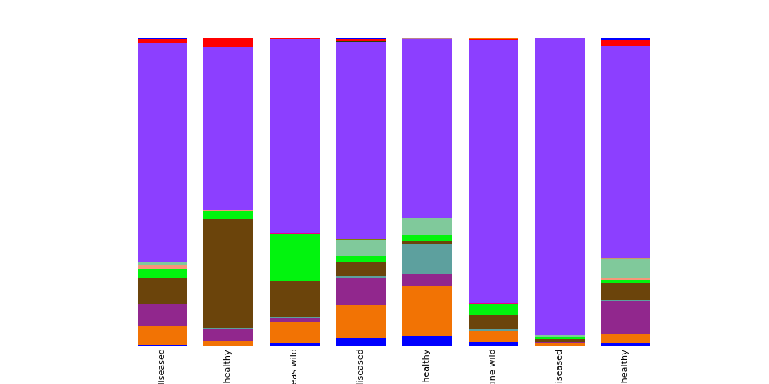
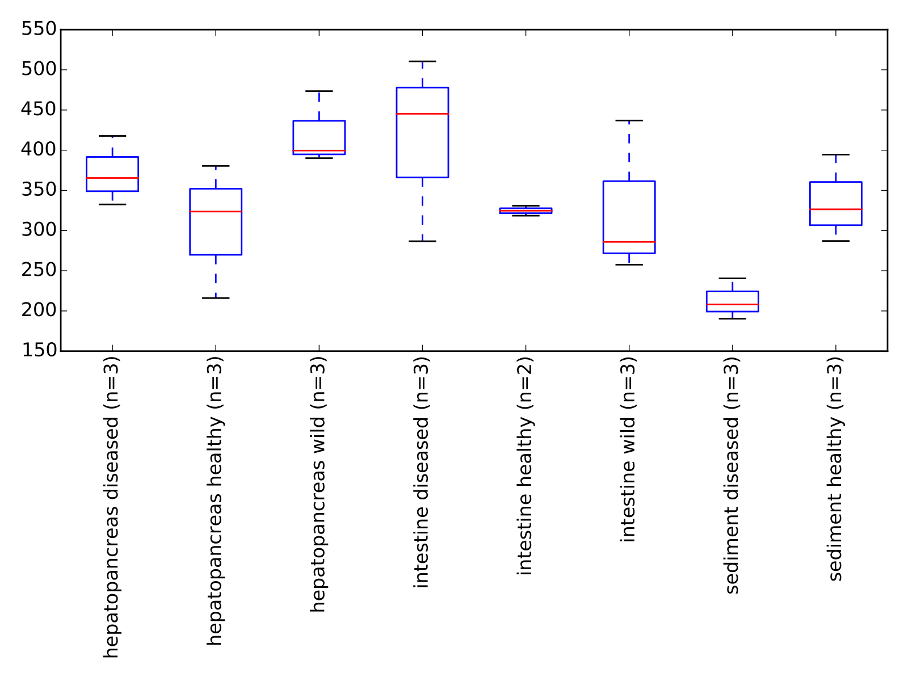

# QIIME - version _(1.9.1)_
<!--
## Instalando o Qiime utilizando o Miniconda

 * **Instale o miniconda**
``` shell
  wget https://repo.continuum.io/miniconda/Miniconda2-latest-Linux-x86_64.sh
  bash Miniconda2-latest-Linux-x86_64.sh -b -p $HOME/miniconda2
  export PATH="$HOME/miniconda3/bin:$PATH"
  conda update --all --yes
```

  * **Criando ambiente Qiime**
 ``` shell
  conda create -n qiime1 python=2.7 qiime matplotlib=1.4.3 mock nose -c bioconda
 ```
  * **Ativando ambiente Qiime**
``` shell
  source activate qiime1
```
 * **Verificando configurações do Qiime**
``` shell
print_qiime_config.py -t
```
 * **Desativando ambiente Qiime**
``` shell
  source deactivate
```
 * **Removendo ambiente**
``` shell
  conda remove --name qiime1 --all
```
---

## Preparando dados do Qiime para Phyloseq
### Instalando dependencias
```R
  > source("http://bioconductor.org/biocLite.R")
  > biocLite("phyloseq")
  > biocLite("metagenomeSeq")
  > biocLite("ggplot2")
  > biocLite("vegan")
  > biocLite("randomforests")
  > biocLite("ape")
  > biocLite("microbiome")
  > biocLite("dplyr")
  > biocLite("pheatmap")
  > biocLite("RColorBrewer")
  > biocLite("ggtree")
  > biocLite("DESeq2")
```
-->
## Análises

Na utilização do QIIME 1 são realizadas as seguintes análises:
* Classificação das OTUs
* Diversidade Alfa
* Diversidade Beta

# Processo do Pipeline
* [validate_mapping_file.py](http://qiime.org/scripts/validate_mapping_file.html): Verificar o arquivo de mapeamento informado pelo usuário para os dados necessários.
* [split_library_fastq.py](http://qiime.org/scripts/split_libraries_fastq.html): responsavel pela demultiplexação das sequências
* [count_seqs.py]()em seguida fazemos a contagem do número de reads do arquivo 
* **Estrategia para identificação das OTU's** [Rideout et al. (2014)](https://peerj.com/articles/545/)
    * [pick_open_reference_otus.py](http://qiime.org/scripts/pick_open_reference_otus.html)
    * [pick_closed_reference_otus.py](http://qiime.org/scripts/pick_closed_reference_otus.html)
    * [pick_de_novo_otus.py](http://qiime.org/scripts/pick_de_novo_otus.html)

Depois de escolhido a estrategia é iniciado o processo das analises de diversidade alfa e beta.
* [biom summarize-table](http://biom-format.org/documentation/summarizing_biom_tables.html)
* [core_diversity_analyses.py](http://qiime.org/scripts/core_diversity_analyses.html)
    * [alpha_rarefaction.py](http://qiime.org/scripts/alpha_rarefaction.html)
    * [beta_diversity_through_plots.py](http://qiime.org/scripts/beta_diversity_through_plots.html)
    * [summarize_taxa_through_plots.py](http://qiime.org/scripts/summarize_taxa_through_plots.html)
    * [make_distance_boxplots.py](http://qiime.org/scripts/make_distance_boxplots.html)
    * [compare_alpha_diversity.py](http://qiime.org/scripts/compare_alpha_diversity.html)
    * [group_significance.py](http://qiime.org/scripts/group_significance.html)

* [make_emperor.py](http://biocore.github.io/emperor/build/html/scripts/make_emperor.html)

# Resultados

## Summarize taxa 
 
## Alpha Diversity

## Beta Diversity

---

### Heat map
### 2D Plot PCoA
### Jackknifed

## Referências
1. QIIME (canonically pronounced chime) stands for Quantitative Insights Into Microbial Ecology.<http://qiime.org/>.  Acesso em: 13 Out. 2017.</br>
2. Chapter Nineteen - Advancing Our Understanding of the Human Microbiome Using QIIME. Disponível em <http://www.sciencedirect.com/science/article/pii/B9780124078635000198>. Acesso em: 13 Out. 2017.</br> 
3. QIIME Analyzing 16S sequencing data. Disponível em <http://www.metagenomics.wiki/tools/qiime>. Acesso em: 13 Out. 2017.</br>
4. QIIME workflow. Disponível em <https://sites.google.com/site/knightslabwiki/qiime-workflow>. Acesso em: 13 Out. 2017.</br>
5. Metagenomics at MSI. Disponível em <https://sites.google.com/site/knightslabwiki/metagenomics-at-msi>. Acesso em: 13 Out. 2017.</br>
6. Analyzing Metagenomic Data with QIIME. Disponível em <https://ngs.csr.uky.edu/sites/default/files/Class_9_QIIME.pdf>. Acesso em: 13 Out. 2017.</br>
7. introduction-to-qiime. Disponível em <https://twbattaglia.gitbooks.io/introduction-to-qiime/>. Acesso em: 13 Out. 2017.</br>
